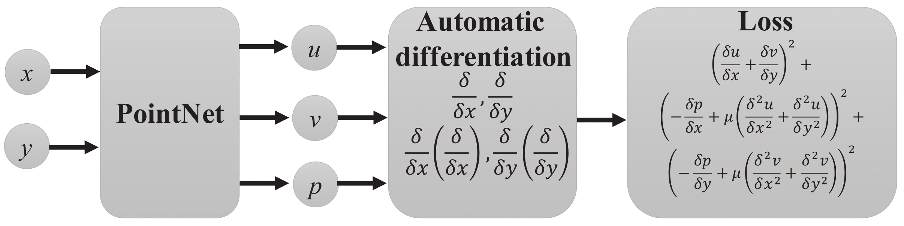

# Physics-Informed PointNet (PIPN) for Flow Prediction in Porous Media (Single Geometry)

**Prediction of Fluid Flow in Porous Media by Sparse Observations and Physics-Informed PointNet (weakly-supervised learning)**

**Author:** Ali Kashefi (kashefi@stanford.edu) 
**Description:** Implementation of physics-informed PointNet (PIPN) for weakly-supervised learning of the Stokes flow in 2D porous media on a single geometry  
**Version:** 1.0  

**Citation**  
If you use the code, please cite the following journal papers:  

**1. [Prediction of fluid flow in porous media by sparse observations and physics-informed PointNet](https://doi.org/10.1016/j.neunet.2023.08.006)**

    @article{kashefi2023PorousMediaPIPN,
      title={Prediction of fluid flow in porous media by sparse observations and physics-informed PointNet},
      author={Kashefi, Ali and Mukerji, Tapan},
      journal={Neural Networks},
      year={2023},
      publisher={Elsevier}}

**2. [Physics-informed PointNet: A deep learning solver for steady-state incompressible flows and thermal fields on multiple sets of irregular geometries](https://doi.org/10.1016/j.jcp.2022.111510)**

    @article{Kashefi2022PIPN,
      title = {Physics-informed PointNet: A deep learning solver for steady-state incompressible flows and thermal fields on multiple sets of irregular geometries},
      journal = {Journal of Computational Physics},
      volume = {468},
      pages = {111510},
      year = {2022}, 
      issn = {0021-9991},
      author = {Ali Kashefi and Tapan Mukerji}}
    
**Physics-informed PointNet on Wikipedia**  
A general description of physics-informed neural networks (PINNs) and its other versions such as PIPN can be found in the following Wikipedia page: 
[Physics-informed PointNet (PIPN) for multiple sets of irregular geometries](https://en.wikipedia.org/wiki/Physics-informed_neural_networks#Physics-informed_PointNet_(PIPN)_for_multiple_sets_of_irregular_geometries)

**Physics-informed PointNet Presentation in Machine Learning + X seminars 2022 at Brown University** 
In case of your interest, you might watch the recorded machine learning seminar with the topic of PIPN at Brown University using the following link:  
[Video Presentation of PIPN at Brown University](https://www.dropbox.com/s/oafbjl6xaihotqa/GMT20220325-155140_Recording_2560x1440.mp4?dl=0)  
[YouTube Video](https://www.youtube.com/watch?v=faeHARnPSVE)

**Questions?**  
If you have any questions or need assistance, please do not hesitate to contact Ali Kashefi (kashefi@stanford.edu) via email. 

**About the Author**  
Please see the author's website: [Ali Kashefi](https://web.stanford.edu/~kashefi/) 
